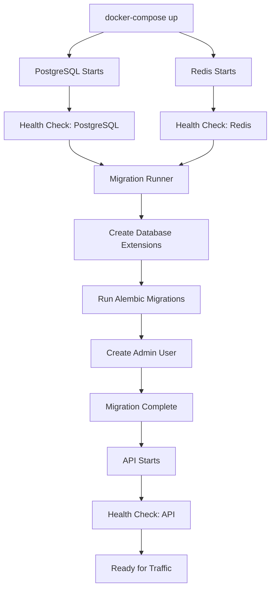

# BlingAuto API - Production Deployment Guide

## 📋 Overview

This guide explains how to deploy the BlingAuto API to production. The deployment is **fully automated** with:
- ✅ Automatic database creation
- ✅ Automatic schema migrations
- ✅ Automatic admin user creation
- ✅ Health checks and graceful startup
- ✅ Production-ready security settings

---

## 🚀 Quick Start Deployment

### 1. Prerequisites

- Docker Engine 20.10+ and Docker Compose V2+
- Minimum 2GB RAM, 10GB disk space
- Linux server (Ubuntu 20.04+ recommended) or any Docker-capable host

### 2. Clone & Configure

```bash
# Clone the repository
git clone <your-repo-url>
cd blingauto_api

# Copy environment template
cp .env.example .env

# Edit configuration (see Configuration section below)
nano .env
```

### 3. Deploy

```bash
# Build and start all services
docker-compose up -d

# Monitor startup logs
docker-compose logs -f

# Check health status
curl http://localhost:8000/health
```

**That's it!** The deployment automatically:
1. Creates PostgreSQL database with extensions
2. Runs all Alembic migrations
3. Creates the initial admin user
4. Starts the API with health checks

---

## ⚙️ Configuration

### Required Environment Variables

Edit `.env` and **change these values**:

```bash
# Database Password (CHANGE THIS!)
POSTGRES_PASSWORD=your_secure_database_password_here

# Redis Password (CHANGE THIS!)
REDIS_PASSWORD=your_secure_redis_password_here

# Application Secret Key (CHANGE THIS!)
# Generate with: openssl rand -hex 32
SECRET_KEY=your_64_character_hex_secret_key_here

# Initial Admin Credentials (REQUIRED)
INITIAL_ADMIN_EMAIL=admin@yourdomain.com
INITIAL_ADMIN_PASSWORD=YourSecurePassword123!
INITIAL_ADMIN_FIRST_NAME=Admin
INITIAL_ADMIN_LAST_NAME=User
```

### Optional Configuration

```bash
# Email (for password reset, etc.)
SMTP_HOST=smtp.gmail.com
SMTP_PORT=587
SMTP_USERNAME=your-email@gmail.com
SMTP_PASSWORD=your-app-password
SMTP_FROM_EMAIL=noreply@yourdomain.com

# Frontend URL (for CORS and email links)
FRONTEND_URL=https://yourdomain.com

# Performance Tuning
WORKERS=4                      # API worker processes
DATABASE_POOL_SIZE=10          # DB connection pool
REDIS_MAX_CONNECTIONS=20       # Redis connections
```

---

## 🏗️ Architecture

### Service Stack

```
┌─────────────────────────────────────────┐
│  BlingAuto API (FastAPI + Uvicorn)     │
│  Port: 8000                             │
│  Health: /health                        │
└────────────┬────────────────────────────┘
             │
     ┌───────┴────────┐
     │                │
┌────▼─────┐    ┌────▼─────┐
│PostgreSQL│    │  Redis   │
│Port: 5432│    │Port: 6379│
└──────────┘    └──────────┘
```

### Deployment Flow



---

## 🔒 Security Checklist

Before deploying to production, ensure:

- [ ] Changed `POSTGRES_PASSWORD` to a strong password (20+ characters)
- [ ] Changed `REDIS_PASSWORD` to a strong password (20+ characters)
- [ ] Generated new `SECRET_KEY` (use `openssl rand -hex 32`)
- [ ] Set `INITIAL_ADMIN_PASSWORD` to a secure password
- [ ] Set `ENVIRONMENT=production` and `DEBUG=false`
- [ ] Configured SSL/TLS (via reverse proxy like Nginx/Traefik)
- [ ] Set up firewall rules (only expose necessary ports)
- [ ] Enabled database backups
- [ ] Reviewed CORS settings for your frontend domain
- [ ] Set up monitoring and logging
- [ ] Changed admin password after first login

---

## 📊 Database Management

### Automatic Setup

The database is **automatically** initialized on first deployment:

1. **PostgreSQL Container** creates the database using `POSTGRES_DB`
2. **init-db.sql** script runs automatically to:
   - Enable UUID and text search extensions
   - Set timezone to UTC
   - Configure permissions
3. **Migration Runner** applies all Alembic migrations
4. **Admin User** is created automatically from environment variables

### Manual Migration Commands

```bash
# Check migration status
docker-compose exec api alembic current

# View migration history
docker-compose exec api alembic history

# Run migrations manually (usually not needed)
docker-compose exec api alembic upgrade head

# Create new migration
docker-compose exec api alembic revision --autogenerate -m "description"
```

### Database Backup

```bash
# Backup database
docker-compose exec postgres pg_dump -U blingauto_user blingauto > backup_$(date +%Y%m%d).sql

# Restore database
docker-compose exec -T postgres psql -U blingauto_user blingauto < backup_20250102.sql
```

---

## 🏥 Health Monitoring

### Health Endpoints

```bash
# Overall health
curl http://localhost:8000/health

# Database health
curl http://localhost:8000/health/db

# Redis health
curl http://localhost:8000/health/redis
```

### Container Health

```bash
# Check all services
docker-compose ps

# View logs
docker-compose logs api
docker-compose logs postgres
docker-compose logs redis

# Follow logs in real-time
docker-compose logs -f
```

### Automated Health Checks

Docker Compose automatically performs health checks:
- **PostgreSQL**: Every 10s, 5 retries
- **Redis**: Every 10s, 5 retries
- **API**: Every 30s, 3 retries

Services won't start until their dependencies are healthy.

---

## 🔄 Updates & Maintenance

### Deploying Updates

```bash
# Pull latest code
git pull

# Rebuild and restart
docker-compose build api
docker-compose up -d

# Migrations run automatically on startup
```

### Viewing Logs

```bash
# All services
docker-compose logs --tail=100 -f

# Specific service
docker-compose logs api --tail=100 -f

# Since specific time
docker-compose logs --since="2025-01-02T10:00:00"
```

### Restart Services

```bash
# Restart all
docker-compose restart

# Restart specific service
docker-compose restart api

# Stop all
docker-compose stop

# Start all
docker-compose start
```

---

## 🌐 Reverse Proxy Setup (Nginx)

### Nginx Configuration Example

```nginx
server {
    listen 80;
    server_name api.yourdomain.com;
    return 301 https://$server_name$request_uri;
}

server {
    listen 443 ssl http2;
    server_name api.yourdomain.com;

    # SSL Configuration
    ssl_certificate /path/to/cert.pem;
    ssl_certificate_key /path/to/key.pem;

    # Proxy Settings
    location / {
        proxy_pass http://localhost:8000;
        proxy_http_version 1.1;
        proxy_set_header Upgrade $http_upgrade;
        proxy_set_header Connection 'upgrade';
        proxy_set_header Host $host;
        proxy_set_header X-Real-IP $remote_addr;
        proxy_set_header X-Forwarded-For $proxy_add_x_forwarded_for;
        proxy_set_header X-Forwarded-Proto $scheme;
        proxy_cache_bypass $http_upgrade;

        # Timeouts
        proxy_connect_timeout 60s;
        proxy_send_timeout 60s;
        proxy_read_timeout 60s;
    }

    # Health check endpoint (optional rate limiting bypass)
    location /health {
        proxy_pass http://localhost:8000;
        access_log off;
    }
}
```

---

## 📈 Performance Tuning

### Scaling Workers

Edit `.env`:
```bash
# Number of API worker processes
# Recommended: 2-4 per CPU core
WORKERS=4
```

### Database Connection Pool

```bash
DATABASE_POOL_SIZE=10          # Concurrent connections
DATABASE_MAX_OVERFLOW=20       # Extra connections when needed
DATABASE_POOL_TIMEOUT=30       # Seconds to wait for connection
```

### Redis Configuration

```bash
REDIS_MAX_CONNECTIONS=20       # Connection pool size
REDIS_TTL=300                  # Cache TTL in seconds
```

---

## 🐛 Troubleshooting

### Database Connection Issues

```bash
# Check if PostgreSQL is running
docker-compose ps postgres

# Check PostgreSQL logs
docker-compose logs postgres

# Connect to database manually
docker-compose exec postgres psql -U blingauto_user -d blingauto
```

### Migration Failures

```bash
# View migration logs
docker-compose logs migrations

# Manually run migrations
docker-compose run --rm migrations
```

### API Not Starting

```bash
# Check API logs
docker-compose logs api

# Verify environment variables
docker-compose exec api env | grep DATABASE_URL

# Check health
curl http://localhost:8000/health
```

### Reset Everything

```bash
# WARNING: Destroys all data!
docker-compose down -v
docker-compose up -d
```

---

## 📞 Support

For issues or questions:
- Check logs: `docker-compose logs`
- Review this guide
- Check [GitHub Issues](your-repo-url/issues)

---

## 📄 License

[Your License Here]
