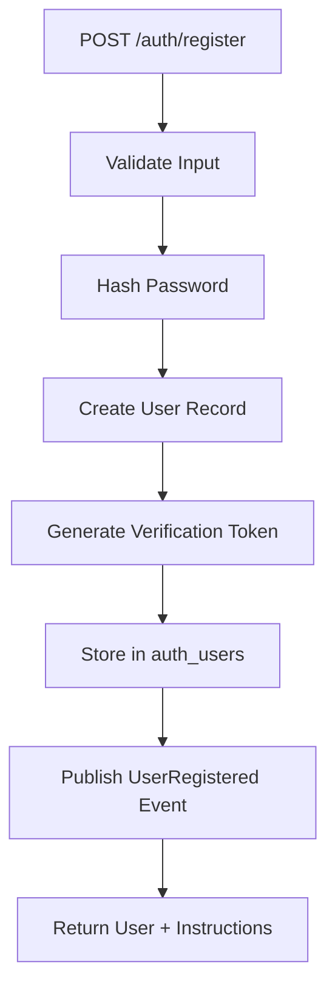
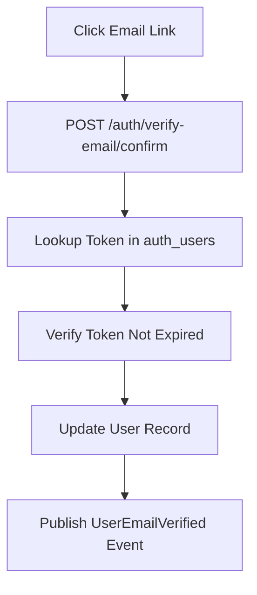
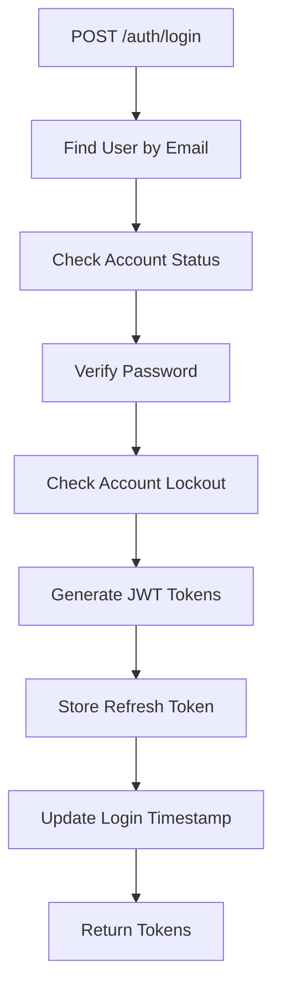
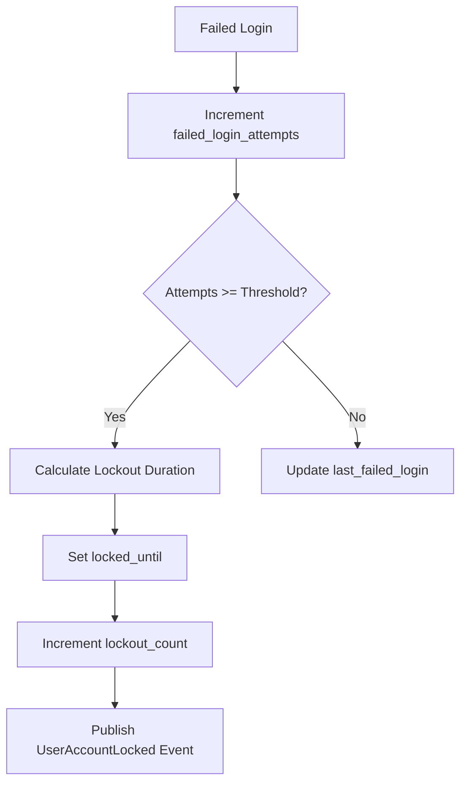
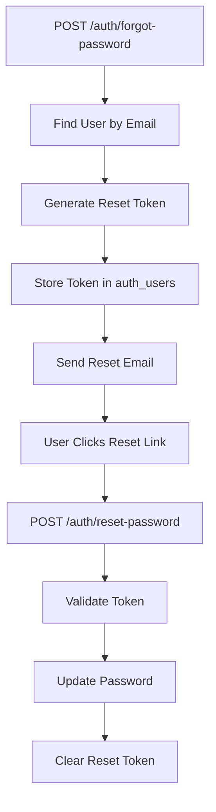

# 🎯 Current Implementation - Auth Feature

## Overview

This document details the current implementation of the auth feature, including exactly what tables are created, how data flows, and how the system works in practice.

## 📊 Current Database Schema

### Auth Users Table (IMPLEMENTED)

The auth module currently creates and manages one primary table:

```sql
-- Table: auth_users
-- Purpose: Central user management with all auth features integrated
-- Location: PostgreSQL database specified in DATABASE_URL

CREATE TABLE auth_users (
    -- Primary identification
    id                          UUID PRIMARY KEY,           -- Auto-generated UUID
    email                       VARCHAR(255) NOT NULL UNIQUE, -- Login identifier
    password_hash               VARCHAR(255) NOT NULL,       -- Bcrypt hashed password
    first_name                  VARCHAR(100) NOT NULL,       -- User's first name
    last_name                   VARCHAR(100) NOT NULL,       -- User's last name
    phone                       VARCHAR(20),                 -- Optional phone number
    
    -- Authorization
    role                        VARCHAR(20) NOT NULL DEFAULT 'client', -- admin|manager|washer|client
    is_active                   BOOLEAN NOT NULL DEFAULT true,          -- Account status
    
    -- Email Verification Feature
    email_verified              BOOLEAN NOT NULL DEFAULT false,         -- Verification status
    email_verified_at           TIMESTAMP,                              -- When verified
    email_verification_token    VARCHAR(255),                           -- Verification token (hashed)
    email_verification_expires  TIMESTAMP,                              -- Token expiration
    
    -- Password Reset Feature  
    password_reset_token        VARCHAR(255),                           -- Reset token (hashed)
    password_reset_expires      TIMESTAMP,                              -- Token expiration
    password_reset_requested_at TIMESTAMP,                              -- When reset requested
    password_changed_at         TIMESTAMP,                              -- Last password change
    
    -- Account Lockout Feature
    failed_login_attempts       INTEGER NOT NULL DEFAULT 0,             -- Failed attempt counter
    locked_until               TIMESTAMP,                                -- Lockout expiration
    lockout_count              INTEGER NOT NULL DEFAULT 0,              -- Progressive lockout counter
    last_failed_login          TIMESTAMP,                               -- Last failed attempt
    
    -- Session Management Feature
    last_login                 TIMESTAMP,                               -- Last successful login
    refresh_tokens             JSON DEFAULT '[]',                      -- Active refresh tokens (array)
    
    -- Audit Fields
    created_at                 TIMESTAMP NOT NULL DEFAULT CURRENT_TIMESTAMP, -- Record creation
    updated_at                 TIMESTAMP NOT NULL DEFAULT CURRENT_TIMESTAMP  -- Last update
);

-- Indexes for performance
CREATE INDEX idx_auth_users_email ON auth_users(email);
CREATE INDEX idx_auth_users_role ON auth_users(role);
CREATE INDEX idx_auth_users_email_verification_token ON auth_users(email_verification_token);
CREATE INDEX idx_auth_users_password_reset_token ON auth_users(password_reset_token);
CREATE INDEX idx_auth_users_locked_until ON auth_users(locked_until);
```

## 🔄 Data Flow & Feature Integration

### 1. User Registration Flow


**Database Changes:**
```sql
INSERT INTO auth_users (
    id, email, password_hash, first_name, last_name,
    role, email_verified, email_verification_token, email_verification_expires,
    created_at, updated_at
) VALUES (
    gen_random_uuid(), 
    'user@example.com', 
    '$2b$12$...', -- bcrypt hash
    'John', 'Doe',
    'client', false, 'hashed_token_123', '2024-01-02 12:00:00',
    NOW(), NOW()
);
```

### 2. Email Verification Flow


**Database Changes:**
```sql
UPDATE auth_users 
SET email_verified = true,
    email_verified_at = NOW(),
    email_verification_token = NULL,
    email_verification_expires = NULL,
    updated_at = NOW()
WHERE email_verification_token = 'hashed_token_123'
  AND email_verification_expires > NOW();
```

### 3. Login & Token Rotation Flow


**Database Changes:**
```sql
-- Reset failed attempts on successful login
UPDATE auth_users 
SET failed_login_attempts = 0,
    last_login = NOW(),
    refresh_tokens = refresh_tokens || '[{
        "token_hash": "abc123...",
        "family_id": "family_xyz", 
        "expires_at": "2024-01-09T12:00:00",
        "created_at": "2024-01-02T12:00:00",
        "last_used": "2024-01-02T12:00:00"
    }]'::json,
    updated_at = NOW()
WHERE email = 'user@example.com';
```

### 4. Account Lockout Flow (Failed Login)


**Database Changes:**
```sql
-- Progressive lockout: 5min -> 10min -> 20min -> 60min
UPDATE auth_users 
SET failed_login_attempts = failed_login_attempts + 1,
    locked_until = NOW() + INTERVAL '5 minutes' * POWER(2, lockout_count),
    lockout_count = lockout_count + 1,
    last_failed_login = NOW(),
    updated_at = NOW()
WHERE email = 'user@example.com'
  AND failed_login_attempts >= 4; -- 5th attempt triggers lockout
```

### 5. Password Reset Flow


**Database Changes:**
```sql
-- Store reset token
UPDATE auth_users 
SET password_reset_token = 'hashed_reset_token_456',
    password_reset_expires = NOW() + INTERVAL '2 hours',
    password_reset_requested_at = NOW(),
    updated_at = NOW()
WHERE email = 'user@example.com';

-- Complete password reset
UPDATE auth_users 
SET password_hash = '$2b$12$new_hash...',
    password_reset_token = NULL,
    password_reset_expires = NULL,
    password_changed_at = NOW(),
    failed_login_attempts = 0, -- Reset lockout on password change
    lockout_count = 0,
    locked_until = NULL,
    updated_at = NOW()
WHERE password_reset_token = 'hashed_reset_token_456'
  AND password_reset_expires > NOW();
```

## 📋 Field Usage by Feature

### Core Authentication
- `id`, `email`, `password_hash`, `first_name`, `last_name`, `phone`
- `role`, `is_active`
- `created_at`, `updated_at`

### Email Verification Feature
- `email_verified`, `email_verified_at`
- `email_verification_token`, `email_verification_expires`

### Password Reset Feature  
- `password_reset_token`, `password_reset_expires`
- `password_reset_requested_at`, `password_changed_at`

### Account Lockout Feature
- `failed_login_attempts`, `locked_until`
- `lockout_count`, `last_failed_login`

### Token Rotation Feature
- `refresh_tokens` (JSON array)
- `last_login`

## 🔧 JSON Structure Details

### Refresh Tokens JSON Format
```json
[
  {
    "token_hash": "sha256_hash_of_token",
    "family_id": "uuid_for_token_family",
    "expires_at": "2024-01-09T12:00:00.000Z",
    "created_at": "2024-01-02T12:00:00.000Z", 
    "last_used": "2024-01-02T12:00:00.000Z"
  },
  {
    "token_hash": "another_token_hash",
    "family_id": "different_family_id",
    "expires_at": "2024-01-10T15:30:00.000Z",
    "created_at": "2024-01-03T15:30:00.000Z",
    "last_used": "2024-01-03T15:30:00.000Z"
  }
]
```

**Why JSON instead of separate table?**
- **Simplicity**: Keeps all user data in one place
- **Performance**: No additional joins needed
- **Atomic Updates**: Token operations are atomic with user updates
- **Scalability**: PostgreSQL JSON is highly optimized

## 🎭 Role-Based Access Examples

### Current User Hierarchy in Database
```sql
-- Admin users (can manage everyone)
SELECT * FROM auth_users WHERE role = 'admin';

-- Managers (can manage washers and clients)  
SELECT * FROM auth_users WHERE role = 'manager';

-- Washers (can manage own profile)
SELECT * FROM auth_users WHERE role = 'washer';

-- Clients (can manage own profile)
SELECT * FROM auth_users WHERE role = 'client';
```

### Permission Queries
```sql
-- Find all users a manager can manage
SELECT * FROM auth_users 
WHERE role IN ('washer', 'client') 
  AND is_active = true;

-- Find all admins who can modify a specific user
SELECT * FROM auth_users 
WHERE role = 'admin' 
  AND is_active = true;

-- Check if user can be assigned to a specific role
-- (Business logic: only admins can create other admins)
```

## 🔒 Security Implementation Details

### Password Security
- **Algorithm**: bcrypt with 12 rounds
- **Storage**: Only hash stored, never plain text
- **Rotation**: password_changed_at tracks last change

### Token Security
- **JWT Access Tokens**: Short-lived (15 minutes default)
- **Refresh Tokens**: Longer-lived (7 days default) with rotation
- **Storage**: Only SHA256 hashes stored in database
- **Family Tracking**: Detects token reuse attacks

### Account Protection
- **Progressive Lockout**: 5min → 10min → 20min → 60min
- **Attempt Tracking**: failed_login_attempts counter
- **Auto-Unlock**: locked_until timestamp expires automatically

## 🎯 Real Example Data

Here's what a typical user record looks like:

```sql
-- Active user with verified email
INSERT INTO auth_users VALUES (
    '123e4567-e89b-12d3-a456-426614174000',
    'john.doe@example.com',
    '$2b$12$LQv3c1yqBWVHxkd0LHAkCOYz6TtxMQJqhN8/LQv3c1yqBWVHxkd0LH',
    'John',
    'Doe', 
    '+1234567890',
    'client',
    true,
    true,
    '2024-01-02 10:30:00',
    null,
    null,
    null,
    null,
    null,
    null,
    0,
    null,
    0,
    null,
    '2024-01-02 14:20:00',
    '[{
        "token_hash": "abc123def456...",
        "family_id": "fam_xyz789",
        "expires_at": "2024-01-09T14:20:00.000Z",
        "created_at": "2024-01-02T14:20:00.000Z",
        "last_used": "2024-01-02T14:20:00.000Z"
    }]',
    '2024-01-02 10:00:00',
    '2024-01-02 14:20:00'
);
```

## 🚀 Performance Characteristics

### Query Performance
- **User lookup by email**: O(1) with unique index
- **Token validation**: O(1) with indexed token fields  
- **Role filtering**: O(log n) with role index
- **Lockout checks**: O(1) with timestamp comparison

### Storage Efficiency
- **Average user record**: ~2KB including JSON tokens
- **Index overhead**: ~20% of table size
- **JSON operations**: Native PostgreSQL optimization

### Scalability Notes
- **Read scaling**: Excellent (mostly SELECT operations)
- **Write scaling**: Good (single table updates)
- **Concurrent logins**: Handled via JSON array append
- **Token cleanup**: Automatic via application logic

This implementation provides a solid foundation that can scale to hundreds of thousands of users while maintaining excellent performance and security.