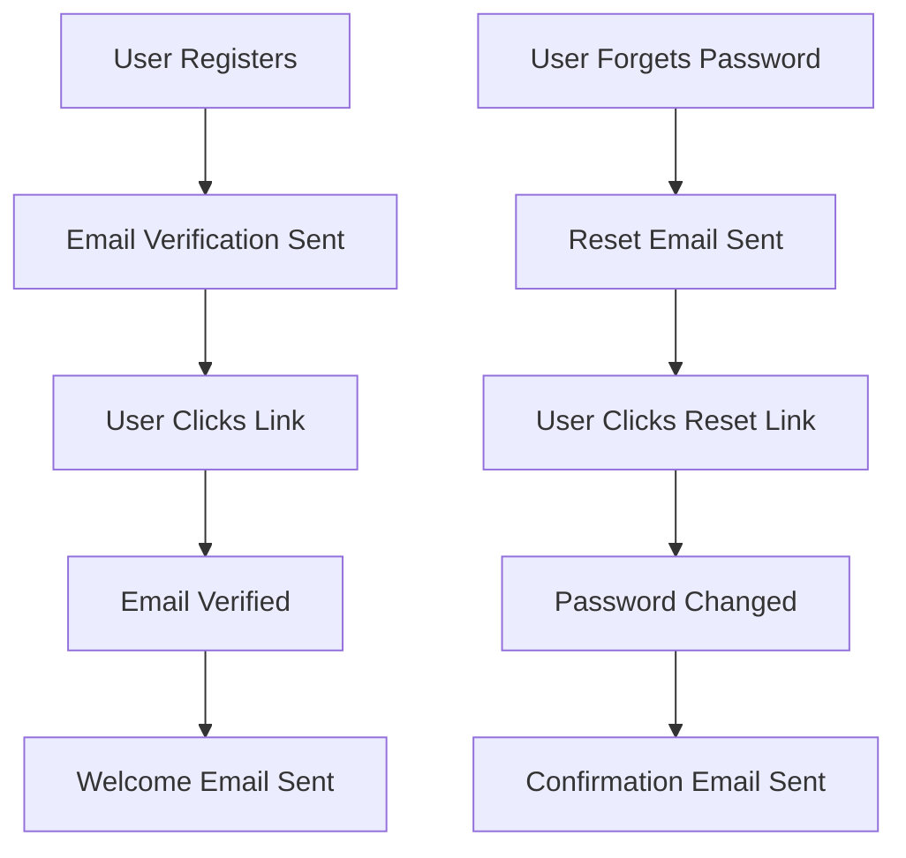

# 📧 Email Authentication System

The Car Wash API includes a complete email verification system that automatically sends professional emails for user registration, password resets, and security notifications.

## 🚀 Quick Start

### For Development (5 seconds)
```bash
# Copy development template
cp env-templates/development.env .env

# Start the API
python main.py

# Test registration - emails will be logged to console
curl -X POST http://localhost:8001/auth/register \
  -H "Content-Type: application/json" \
  -d '{"email": "test@example.com", "password": "SecurePass123!", "first_name": "John", "last_name": "Doe"}'
```

### For Production with Gmail (5 minutes)
```bash
# Copy Gmail template
cp env-templates/gmail.env .env

# Edit .env with your Gmail credentials
# See docs/GMAIL_SETUP_QUICK_GUIDE.md for detailed steps
```

## 📚 Documentation

| Guide | Description |
|-------|-------------|
| [📖 Complete Setup Guide](EMAIL_SETUP_GUIDE.md) | Comprehensive guide for all email providers |
| [⚡ Gmail Quick Setup](GMAIL_SETUP_QUICK_GUIDE.md) | Get started with Gmail in 5 minutes |

## 📁 Configuration Templates

| Template | Use Case |
|----------|----------|
| `env-templates/development.env` | Development (mock emails) |
| `env-templates/gmail.env` | Production with Gmail |
| `env-templates/sendgrid.env` | Production with SendGrid |

## ✨ What's Included

### Automatic Emails
- ✅ **Registration verification** - Beautiful branded emails with secure links
- ✅ **Password reset** - Secure reset links with expiration
- ✅ **Welcome emails** - Sent after successful verification
- ✅ **Security notifications** - Password change confirmations

### Email Templates
- 📱 **Responsive HTML** - Looks great on mobile and desktop
- 📝 **Plain text fallback** - For email clients that don't support HTML
- 🎨 **Professional design** - Branded with your company colors
- 🔗 **Smart links** - Automatically includes your app URL

### Security Features
- 🔒 **Secure tokens** - Cryptographically secure verification links
- ⏰ **Token expiration** - Links expire automatically for security
- 🚦 **Rate limiting** - Prevents email spam and abuse
- 📊 **Audit logging** - Track all email sending activity

## 🔧 Supported Providers

| Provider | Best For | Free Tier | Setup Difficulty |
|----------|----------|-----------|------------------|
| **Mock** | Development | Unlimited | ⭐ Easy |
| **Gmail** | Small projects | 500/day | ⭐⭐ Easy |
| **SendGrid** | Production | 100/day | ⭐⭐⭐ Medium |
| **AWS SES** | Enterprise | 62K/month | ⭐⭐⭐⭐ Advanced |

## 🧪 Testing

```bash
# Test email service
python quick_email_test.py

# Test complete registration flow
python main.py
# Then use the API documentation at http://localhost:8001/docs
```

## 📊 Email Flow



## 🚨 Important Notes

### Security
- Never commit email credentials to version control
- Use App Passwords for Gmail (not your regular password)
- Enable 2-Factor Authentication on email accounts
- Use environment variables for all sensitive configuration

### Production Considerations
- **Gmail**: 500-2,000 emails/day limit
- **SendGrid**: Professional deliverability, detailed analytics
- **AWS SES**: Most cost-effective for high volume
- **Custom SMTP**: Ensure proper authentication and TLS

### Email Deliverability
- Verify sender domains/emails with your provider
- Set up SPF, DKIM, and DMARC records for your domain
- Monitor bounce rates and spam complaints
- Use professional "from" addresses (noreply@yourcompany.com)

## 🆘 Need Help?

1. **Check the logs** - Enable debug logging: `LOGGING_LOG_LEVEL=DEBUG`
2. **Test your config** - Run `python quick_email_test.py`
3. **Review the guides** - See detailed setup instructions in `docs/`
4. **Common issues** - Check troubleshooting section in setup guide

## 🎯 What Happens When Users Register

1. **User submits registration** → `POST /auth/register`
2. **Account created** → User stored in database
3. **Verification email sent** → Professional email with secure link
4. **User clicks link** → `POST /auth/verify-email/confirm`
5. **Email verified** → Account activated
6. **Welcome email sent** → Greeting and next steps

## 🔄 What Happens for Password Reset

1. **User requests reset** → `POST /auth/forgot-password`
2. **Reset email sent** → Secure reset link (2-hour expiry)
3. **User clicks link** → Opens password reset form
4. **New password set** → `POST /auth/reset-password`
5. **Password updated** → All sessions invalidated
6. **Confirmation sent** → Security notification email

---

Your Car Wash API now has enterprise-grade email authentication! 🎉