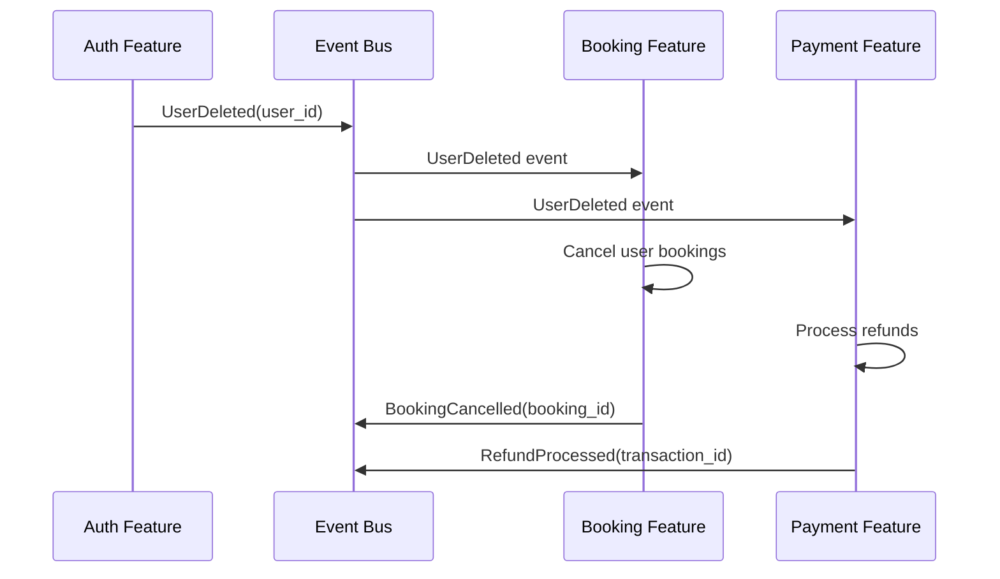
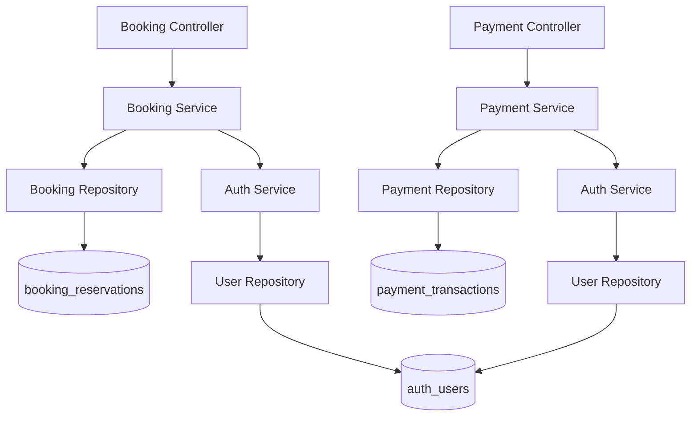

# 🏗️ Feature-Based Architecture & Table Relationships

## Overview

This document illustrates how features work together, manage their own data, and communicate in the refactored Car Wash API architecture.

## 🎯 Current Architecture (Implemented)

```
┌─────────────────────────────────────────────────────────────────┐
│                        FastAPI Application                      │
├─────────────────────────────────────────────────────────────────┤
│                                                                 │
│  ┌─────────────────┐    ┌─────────────────┐    ┌─────────────┐ │
│  │   Auth Feature  │    │  Future: Booking│    │Future: Payment│ │
│  │    (Active)     │    │    Feature      │    │   Feature   │ │
│  └─────────────────┘    └─────────────────┘    └─────────────┘ │
│           │                       │                      │      │
│  ┌─────────────────┐    ┌─────────────────┐    ┌─────────────┐ │
│  │   auth_users    │    │ booking_services│    │payment_trans│ │
│  │     (table)     │    │ booking_reserva │    │   actions   │ │
│  │                 │    │     (tables)    │    │  (tables)   │ │
│  └─────────────────┘    └─────────────────┘    └─────────────┘ │
│           │                       │                      │      │
├───────────┼───────────────────────┼──────────────────────┼──────┤
│           │                       │                      │      │
│  ┌─────────────────────────────────────────────────────────────┐ │
│  │                 Shared Event Bus                            │ │
│  │         (Inter-Feature Communication)                       │ │
│  └─────────────────────────────────────────────────────────────┘ │
│                                                                 │
│  ┌─────────────────────────────────────────────────────────────┐ │
│  │              Shared Database Layer                          │ │
│  │    (Connection Pool, Session Management)                    │ │
│  └─────────────────────────────────────────────────────────────┘ │
└─────────────────────────────────────────────────────────────────┘
             │
             ▼
    ┌─────────────────┐
    │   PostgreSQL    │
    │    Database     │
    │                 │
    │  auth_users     │ ◄── Currently Implemented
    │  booking_*      │ ◄── Future Tables
    │  payment_*      │ ◄── Future Tables
    │  location_*     │ ◄── Future Tables
    └─────────────────┘
```

## 🔄 Feature Interaction Patterns

### 1. Event-Driven Communication (Recommended)



### 2. Service Layer Integration



## 📊 Table Relationship Strategy

### Current Implementation: Auth Feature

```sql
-- CURRENT: Auth feature owns all user data
CREATE TABLE auth_users (
    id UUID PRIMARY KEY,
    email VARCHAR(255) UNIQUE,
    role VARCHAR(20),
    -- ... all auth-related fields
);

-- Future features reference users by ID only
-- No foreign key constraints for loose coupling
```

### Future: Multi-Feature Database

```sql
-- AUTH FEATURE TABLES
CREATE TABLE auth_users (
    id UUID PRIMARY KEY,
    email VARCHAR(255) UNIQUE,
    password_hash VARCHAR(255),
    role VARCHAR(20),
    -- ... auth-specific fields
);

CREATE TABLE auth_user_sessions (
    id UUID PRIMARY KEY,
    user_id UUID, -- No FK constraint
    session_token VARCHAR(255),
    -- ... session fields
);

-- BOOKING FEATURE TABLES  
CREATE TABLE booking_services (
    id UUID PRIMARY KEY,
    name VARCHAR(100),
    price_cents INTEGER,
    -- ... service fields
);

CREATE TABLE booking_reservations (
    id UUID PRIMARY KEY,
    customer_id UUID, -- References auth_users.id (app-level)
    service_id UUID,  -- References booking_services.id
    washer_id UUID,   -- References auth_users.id (app-level)
    -- ... booking fields
    
    -- App-level constraints, not DB constraints
    CONSTRAINT fk_service FOREIGN KEY (service_id) 
        REFERENCES booking_services(id)
);

-- PAYMENT FEATURE TABLES
CREATE TABLE payment_transactions (
    id UUID PRIMARY KEY,
    customer_id UUID, -- References auth_users.id (app-level)
    booking_id UUID,  -- References booking_reservations.id (app-level)
    amount_cents INTEGER,
    -- ... payment fields
);

-- LOCATION FEATURE TABLES
CREATE TABLE location_wash_sites (
    id UUID PRIMARY KEY,
    name VARCHAR(100),
    address TEXT,
    -- ... location fields
);

CREATE TABLE location_staff_assignments (
    id UUID PRIMARY KEY,
    location_id UUID, -- References location_wash_sites.id
    staff_id UUID,    -- References auth_users.id (app-level)
    -- ... assignment fields
    
    CONSTRAINT fk_location FOREIGN KEY (location_id) 
        REFERENCES location_wash_sites(id)
);
```

## 🔗 Relationship Management Rules

### ✅ ALLOWED: Intra-Feature Relationships
```sql
-- Within the same feature: Use proper foreign keys
CREATE TABLE booking_reservation_items (
    id UUID PRIMARY KEY,
    reservation_id UUID NOT NULL,
    service_id UUID NOT NULL,
    
    -- ✅ OK: Both tables owned by booking feature
    CONSTRAINT fk_reservation 
        FOREIGN KEY (reservation_id) REFERENCES booking_reservations(id),
    CONSTRAINT fk_service 
        FOREIGN KEY (service_id) REFERENCES booking_services(id)
);
```

### ❌ AVOIDED: Cross-Feature DB Relationships
```sql
-- ❌ AVOID: Direct foreign keys across features
CREATE TABLE booking_reservations (
    customer_id UUID,
    -- DON'T DO THIS:
    CONSTRAINT fk_customer 
        FOREIGN KEY (customer_id) REFERENCES auth_users(id)
);
```

### ✅ PREFERRED: Application-Level References
```python
# ✅ Handle relationships in application code
class BookingService:
    def __init__(self, auth_service: AuthService):
        self._auth_service = auth_service
        
    async def create_booking(self, customer_id: UUID, ...):
        # Verify customer exists via auth service
        customer = await self._auth_service.get_user_by_id(customer_id)
        if not customer or customer.role not in ['client', 'manager']:
            raise ValueError("Invalid customer")
            
        # Create booking with validated customer_id
        booking = await self._booking_repo.create(
            customer_id=customer_id,
            ...
        )
        
        # Publish event for other features
        await self._event_bus.publish(
            BookingCreated(booking_id=booking.id, customer_id=customer_id)
        )
```

## 📋 Feature Ownership Matrix

| Feature | Tables | Responsibilities | External Dependencies |
|---------|--------|------------------|----------------------|
| **Auth** | `auth_users`<br>`auth_user_sessions`<br>`auth_login_attempts` | User management<br>Authentication<br>Authorization<br>Session tracking | None (core feature) |
| **Booking** | `booking_services`<br>`booking_reservations`<br>`booking_history` | Service catalog<br>Reservation management<br>Staff assignment | Auth (user validation) |
| **Payment** | `payment_transactions`<br>`payment_methods`<br>`payment_refunds` | Payment processing<br>Transaction history<br>Refund management | Auth (user validation)<br>Booking (reservation linking) |
| **Location** | `location_wash_sites`<br>`location_staff_assignments`<br>`location_operating_hours` | Site management<br>Staff scheduling<br>Geographic data | Auth (staff validation) |

## 🔧 Data Access Patterns

### 1. Single Feature Queries (Fast)
```python
# ✅ FAST: Query within one feature
class AuthService:
    async def get_user_with_sessions(self, user_id: UUID):
        # Both tables owned by auth feature
        user = await self._user_repo.get_by_id(user_id)
        sessions = await self._session_repo.get_by_user_id(user_id)
        return UserWithSessions(user=user, sessions=sessions)
```

### 2. Cross-Feature Composition (Good)
```python
# ✅ GOOD: Compose data from multiple features
class BookingService:
    async def get_booking_details(self, booking_id: UUID):
        # Get booking from our feature
        booking = await self._booking_repo.get_by_id(booking_id)
        
        # Get customer from auth feature
        customer = await self._auth_service.get_user_by_id(booking.customer_id)
        
        # Compose result
        return BookingDetails(
            id=booking.id,
            service_name=booking.service_name,
            customer_name=f"{customer.first_name} {customer.last_name}",
            customer_email=customer.email
        )
```

### 3. Batch Loading (Optimal)
```python
# ✅ OPTIMAL: Batch load to avoid N+1 queries
class BookingService:
    async def get_bookings_with_customers(self, booking_ids: List[UUID]):
        # Get all bookings in one query
        bookings = await self._booking_repo.get_many(booking_ids)
        
        # Get all customers in one batch
        customer_ids = [b.customer_id for b in bookings]
        customers = await self._auth_service.get_users_by_ids(customer_ids)
        customer_map = {c.id: c for c in customers}
        
        # Combine efficiently
        return [
            BookingDetails(
                booking=booking,
                customer=customer_map[booking.customer_id]
            )
            for booking in bookings
        ]
```

## 🎭 Integration Examples

### User Profile Across Features
```python
# Each feature contributes to the complete user profile
class UserProfileService:
    async def get_complete_profile(self, user_id: UUID):
        # Auth feature: Basic user data
        user = await self._auth_service.get_user_by_id(user_id)
        
        # Booking feature: Reservation history
        bookings = await self._booking_service.get_user_bookings(user_id)
        
        # Payment feature: Transaction history  
        transactions = await self._payment_service.get_user_transactions(user_id)
        
        return CompleteUserProfile(
            user=user,
            recent_bookings=bookings[:5],
            payment_history=transactions[:10]
        )
```

### Feature-Specific User Views
```python
# Auth feature view: Security-focused
class AuthUserView:
    id: UUID
    email: str
    role: str
    email_verified: bool
    last_login: datetime
    failed_attempts: int

# Booking feature view: Service-focused  
class BookingCustomerView:
    id: UUID
    name: str
    email: str
    total_bookings: int
    preferred_services: List[str]

# Payment feature view: Financial-focused
class PaymentCustomerView:
    id: UUID
    name: str
    total_spent: int
    payment_methods: List[str]
    outstanding_balance: int
```

## 🚀 Scaling Strategy

### Horizontal Scaling by Feature
```yaml
# Different features can scale independently
services:
  auth-service:
    replicas: 3
    database: auth-db-cluster
    
  booking-service:
    replicas: 5  # High booking volume
    database: booking-db-cluster
    
  payment-service:
    replicas: 2
    database: payment-db-cluster
```

### Database Optimization by Feature
```sql
-- Each feature optimizes its own tables
-- Auth feature: Optimize for authentication
CREATE INDEX idx_auth_users_email_active 
    ON auth_users(email) WHERE is_active = true;

-- Booking feature: Optimize for reservations
CREATE INDEX idx_booking_date_status 
    ON booking_reservations(scheduled_at, status);

-- Payment feature: Optimize for transactions
CREATE INDEX idx_payment_customer_date 
    ON payment_transactions(customer_id, created_at DESC);
```

This architecture ensures each feature is self-contained while allowing flexible integration and independent scaling as your application grows.